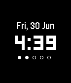

# Minimal Black

> A simple watchface for Pebble and Pebble Time.

## Background

I've forked this project from Amos Tan's [pebble-watchface-minimal]. My primary
motivations were:

- to invert the colors from black-on-white to black-on-white
- to have a starting watchface to tinker and tweak

## Changes

For a complete list of changes, see the commit log.

- Shows a "No Bluetooth" icon and buzzes when Bluetooth disconnects
- Bold the date font, for better readability
- Simplify some of the logic, clean up some of the code

## License

See [LICENSE](LICENSE/).

[pebble-watchface-minimal]: https://github.com/AlphaTRL/pebble-watchface-minimal
